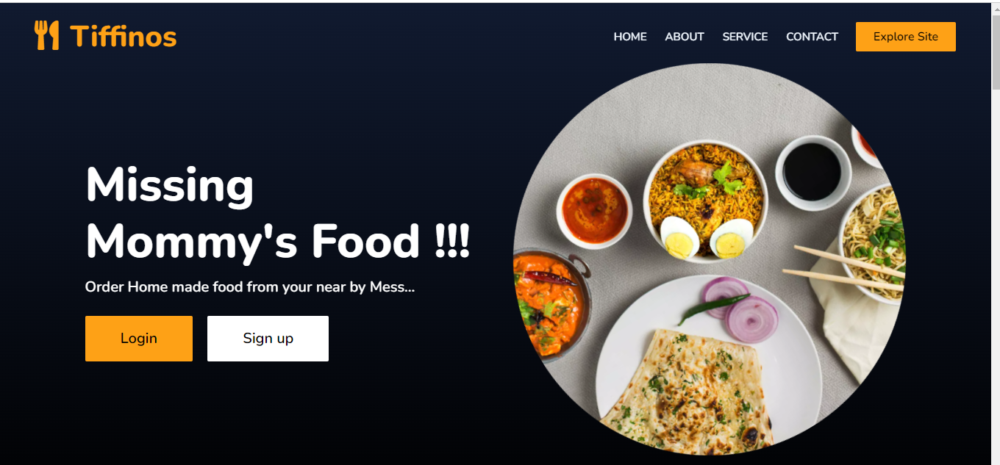
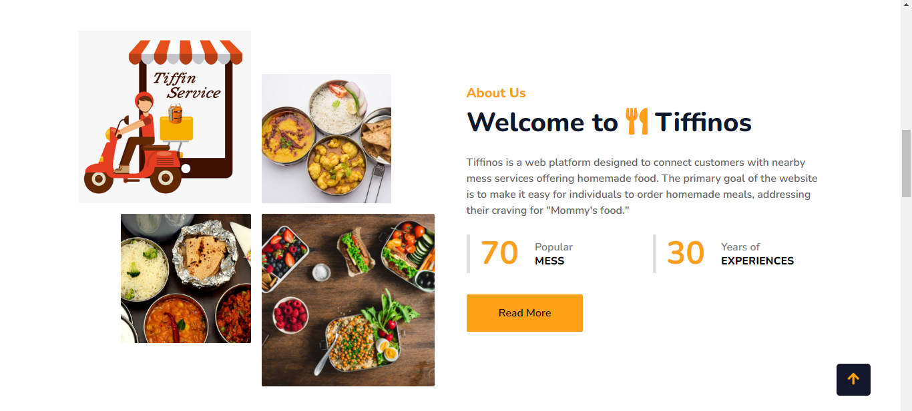
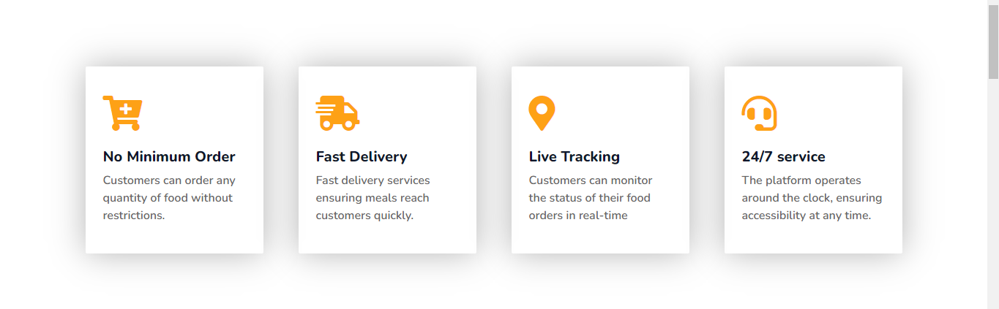
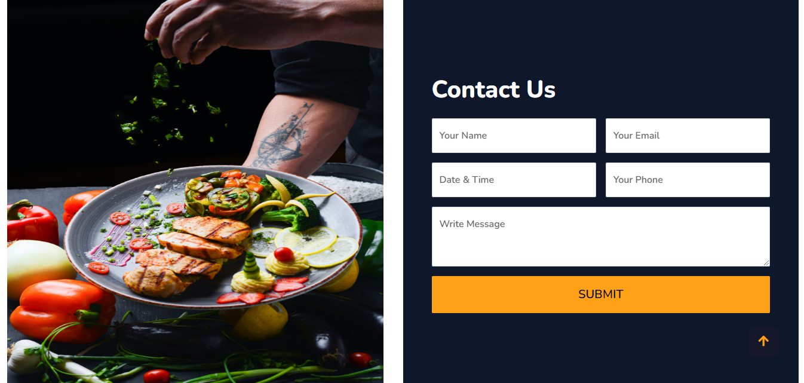
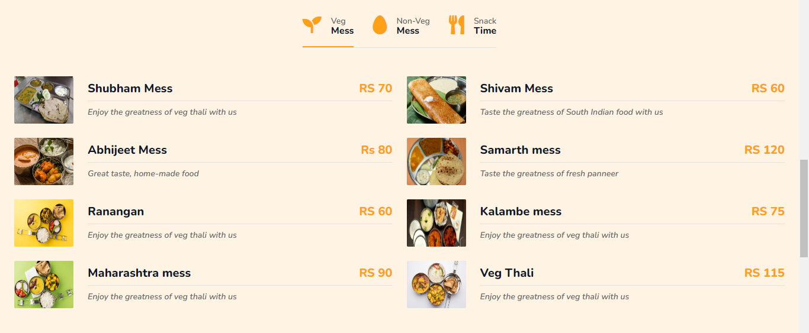
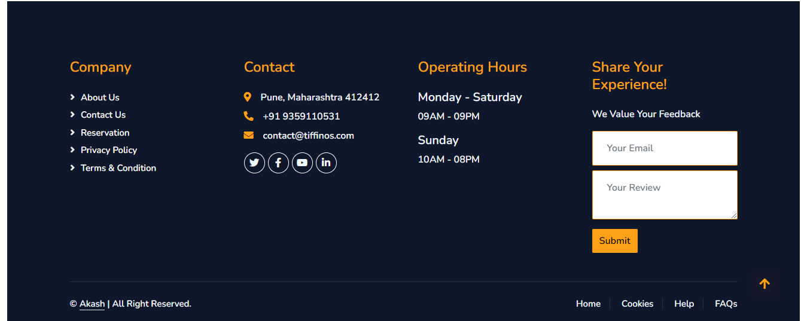

# Tiffinos Website

## Description

Tiffinos is a platform connecting customers with nearby mess services offering homemade food. Our goal is to provide convenient access to delicious homemade meals, satisfying cravings for "Mommy's food."

## Features

- No Minimum Order
- Flash Delivery
- Live Tracking
- 24/7 Service

## Sections

1. **Home:** Introduction to Tiffinos and its unique selling points.
2. **About Us:** Detailed information about Tiffinos, its mission, and experience.
3. **Services:** Explanation of the services provided, including ordering and delivery.
4. **Contact Us:** Contact form and essential contact information.
5. **Feedback & Reviews:** Section for customers to leave feedback and read reviews.

## Operating Hours

- Monday - Saturday: 9:00 AM - 9:00 PM
- Sunday: 10:00 AM - 8:00 PM

## Optional Features

- Loyalty Program
- Referral Program
- Special Promotions & Discounts
- Customer Feedback & Reviews

## Technologies Used

- Frontend: HTML, CSS, JavaScript
- Backend: [Specify your backend technologies]
- Database: [Specify your database system]

## Getting Started

1. Clone the repository: `git clone [repository URL]`
2. Install dependencies: `[instructions for installing dependencies]`
3. Run the application: `[instructions for running the application]`

## Contributing

We welcome contributions from the community. Please follow our [contribution guidelines](CONTRIBUTING.md) for details on how to contribute to the project.

## License

This project is licensed under the [MIT License](LICENSE).

## Screenshots

  
  
<em>Figure 1: Tiffinos Homepage</em>

  
  
<em>Figure 2: About Us Section</em>

  
  
<em>Figure 3: Service Page</em>

  
  
<em>Figure 4: Contact Us Page</em>

  
  
<em>Figure 5: Menu Page</em>

  
  
<em>Figure 6: Footer Page</em>

## Contact

- **Email:** contact@tiffinos.com
- **Website:** www.tiffinos.com
